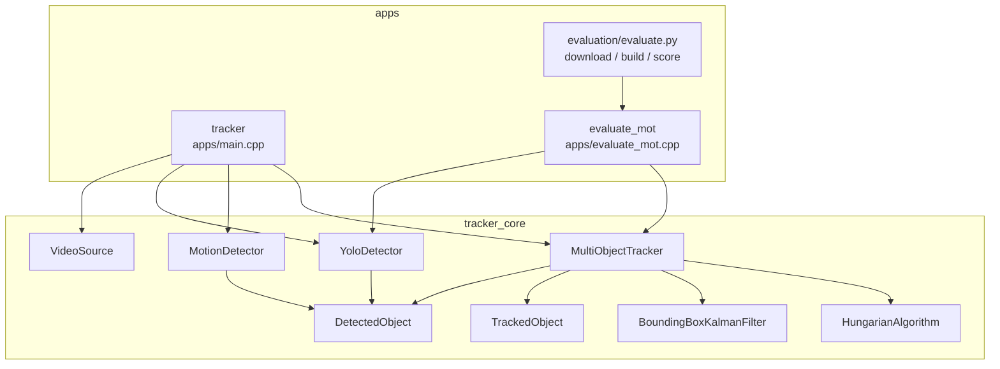

# Components

Ownership, public surface, and the knobs that actually change behavior.
Nothing here is an abstract MOT framework: `tracker_core` is five translation
units plus one header-only filter.



## Library vs apps

`CMakeLists.txt` builds `tracker_core` from:

| File | Compiles |
|---|---|
| `src/video_source.cpp` | `VideoSource` |
| `src/motion_detector.cpp` | `MotionDetector::detect` |
| `src/yolo_detector.cpp` | `YoloDetector` |
| `src/hungarian.cpp` | `HungarianAlgorithm::solve` |
| `src/multi_object_tracker.cpp` | `MultiObjectTracker::update` |

Headers under `include/` are public. `include/kalman.hpp` is the entire Kalman
implementation (no `.cpp`).

Apps:

- `tracker` links `apps/main.cpp` — interactive BGR overlay.
- `evaluate_mot` links `apps/evaluate_mot.cpp` — writes MOT CSV; no GUI, no
  `VideoSource`.

Python (`evaluation/evaluate.py`, `pyproject.toml`) is orchestration + metrics,
not a binding. No pybind/nanobind target exists.

## `VideoSource` — `include/video_source.hpp`

```cpp
struct VideoSource {
    explicit VideoSource(int camera_index = 0);
    explicit VideoSource(const std::string& video_path);
    bool is_open() const;          // capture_.isOpened()
    bool next(cv::Mat& frame);     // capture_.read(frame)
    cv::VideoCapture capture_;     // public
};
```

Owns the capture handle. No FPS/resize/colorspace API. `apps/main.cpp` chooses
file vs `kDefaultCameraIndex = 0` from argv. `evaluate_mot` does not use this type.

## `YoloDetector` — `include/yolo_detector.hpp`

Owns `cv::dnn::Net network_`.

```cpp
explicit YoloDetector(const std::string& model_path,
                      float confidence_threshold = kDefaultConfidenceThreshold,  // 0.25
                      float nms_threshold = kDefaultNmsThreshold,                // 0.45
                      std::optional<int> class_id = std::nullopt);

std::vector<DetectedObject> detect(const cv::Mat& frame);
```

Static: `kInputSize = 640`.

Ctor checks: non-empty path, thresholds in `[0,1]`, `class_id >= 0` if set,
ONNX load via `cv::dnn::readNetFromONNX`. No CUDA/backend selection — OpenCV
default (typically CPU).

`class_id` is a **hard filter on the class-score index**, not NMS class-aware
multi-label. Live `tracker --yolo` leaves it `nullopt` (any COCO class).
`evaluate_mot` passes `kCocoPersonClassId = 0`.

Blob: scale `1/255`, size 640×640, swapRB, **no letterbox**. Decode assumes the
network saw a stretched image.

## `MotionDetector` — `include/motion_detector.hpp`

```cpp
struct MotionDetector {
    cv::Ptr<cv::BackgroundSubtractor> subtractor = cv::createBackgroundSubtractorMOG2();
    double min_area = 500.0;
    std::vector<DetectedObject> detect(const cv::Mat& frame);
};
```

All members public. MOG2 uses OpenCV defaults (typically history 500, `varThreshold`
16, shadows on). Shadow pixels (127) are dropped by a binary threshold at 200.
Morphology 5×5 ellipse open+close is hardcoded in `src/motion_detector.cpp`.

Fallback detector when `apps/main.cpp` is not given `--yolo`. Not used by
`evaluate_mot`.

## `MultiObjectTracker` — `include/multi_object_tracker.hpp`

Owns the track list and the emit buffer.

```cpp
class MultiObjectTracker {
    static constexpr double kMinimumIou = 0.30;
    static constexpr int kMaximumMissedFrames = 5;
    const std::vector<TrackedObject>& update(const std::vector<DetectedObject>& detections);
private:
    struct Track { int id; BoundingBoxKalmanFilter filter; cv::Rect2f predicted_box; int missed_frames; };
    int next_id_ = 1;
    std::vector<Track> tracks_;
    std::vector<TrackedObject> tracked_objects_;
};
```

No constructor parameters. Gate and coast window are class-level constexpr, not
runtime config. `Track` is private; apps only see `TrackedObject`.

`update` is the entire SORT step: predict, cost, Hungarian, IoU gate, correct/miss,
delete, spawn, snapshot `tracked_objects_`.

Returned reference is into `tracked_objects_`. Do not retain across calls.

## `BoundingBoxKalmanFilter` — `include/kalman.hpp`

Owned 1:1 by `MultiObjectTracker::Track`. Not constructed by apps.

```cpp
explicit BoundingBoxKalmanFilter(const cv::Rect2f& initial_box);
cv::Rect2f predict();
cv::Rect2f update(const cv::Rect2f& box);
```

Wraps `cv::KalmanFilter filter_`. State is center-based 6D with vx/vy only on
cx/cy. Noise and F/H are set in the ctor; there is no setter. The `k*` fields
are **instance members**, not `static constexpr`, but they are never mutated.

Eigen is **not** used here despite `target_link_libraries(... Eigen3::Eigen)`.

## `HungarianAlgorithm` — `include/hungarian.hpp`

```cpp
class HungarianAlgorithm {
    using CostMatrix = std::vector<std::vector<double>>;
    static std::vector<int> solve(const CostMatrix& costs);
};
```

No instances. `solve_wide` in the anonymous namespace of `src/hungarian.cpp` is
the JV-style dual-ascent implementation (1-based potentials, slack, augmenting
paths). Rectangular, including tall/wide/empty, is handled at `solve()`.

Used only from `MultiObjectTracker::update`. Unit tests in
`tests/hungarian_test.cpp` include a MOT-shaped `1-IoU` matrix.

## Detection types — `include/detection.hpp`

`DetectedObject` is the only detector→tracker DTO. `ClassifiedObject` is dead.

## App wiring

### `apps/main.cpp`

```text
Usage: tracker [<video-path> | --yolo <model.onnx> [<video-path>]]
```

Owns (stack / unique_ptr):

- exactly one of `YoloDetector` or `MotionDetector`
- one `VideoSource`
- one `MultiObjectTracker`

Does not pass YOLO thresholds or `class_id`. Viz constants: green `(0,255,0)`,
thickness 2, label scale 0.6, `waitKey(1)`, quit `'q'`.

### `apps/evaluate_mot.cpp`

```text
Usage: evaluate_mot <model.onnx> <image-dir> <detections.csv> <tracks.csv> <frame-count>
```

Owns `YoloDetector` (person class) + `MultiObjectTracker`. Frames loaded by
index, not video. Writes both detection and track MOT files so Python can score
detector precision/recall separately from MOTA.

### `evaluation/evaluate.py`

Not a component of `tracker_core`. Sequence `MOT17-05-FRCNN`, frames 1–100
default, IoU 0.50 for scoring (independent of tracker `kMinimumIou = 0.30`).
Builds `--target evaluate_mot` via CMake debug preset, expects
`data/yolo11n.onnx`.

## Hyperparameters that change pipeline behavior

Compile-time / class constants (rebuild to change):

| Knob | Location | Default | Effect |
|---|---|---|---|
| `kMinimumIou` | `MultiObjectTracker` | 0.30 | post-Hungarian match gate; below → miss + possible new ID |
| `kMaximumMissedFrames` | `MultiObjectTracker` | 5 | coast then delete; 5 emits, 6th empty frame drops |
| `kInputSize` | `YoloDetector` | 640 | blob spatial size; decode scale |
| `kProcessNoise` | `BoundingBoxKalmanFilter` | `1e-2` | Q diagonal |
| `kMeasurementNoise` | `BoundingBoxKalmanFilter` | `1e-1` | R diagonal |
| `kInitialStateUncertainty` | `BoundingBoxKalmanFilter` | `1.0` | P0 diagonal |
| MOG2 thresh / kernel | `motion_detector.cpp` | 200 / 5×5 ellipse | shadow drop + morphology |
| MOT `+1` origin | `evaluate_mot.cpp` `write_box` | — | OpenCV → MOTChallenge pixels |

Runtime (ctor / public fields / argv):

| Knob | Where set | Default | Effect |
|---|---|---|---|
| `confidence_threshold` | `YoloDetector` ctor | 0.25 | candidate + NMS score floor |
| `nms_threshold` | `YoloDetector` ctor | 0.45 | OpenCV `NMSBoxes` IoU |
| `class_id` | `YoloDetector` ctor | `nullopt` / `0` in eval | which class score is used |
| `min_area` | `MotionDetector` field | 500 | contour area gate |
| `subtractor` | `MotionDetector` field | MOG2 defaults | background model |
| `--yolo` vs not | `apps/main.cpp` | MOG2 | which detector |
| video path vs camera 0 | `apps/main.cpp` | camera | ingest |
| `--frames` / `--iou` | `evaluate.py` | 100 / 0.50 | scoring only, not tracker |

Not configurable today: letterbox vs stretch, Kalman dt, appearance cost, class
list for live YOLO, `TrackedObject` confidence, miss-window vs hit confirmation
(tracks are confirmed on birth).

## Tests that lock the contracts

- `tests/hungarian_test.cpp` — optimum, tall/wide/empty, finite costs, MOT 1−IoU example
- `tests/multi_object_tracker_test.cpp` — empty frame, ID stability under reorder,
  miss timeout, IoU gate
- `tests/test_evaluation.py` — MOT parse, one-to-one matching, ignore-region
  suppression protecting a pedestrian match
