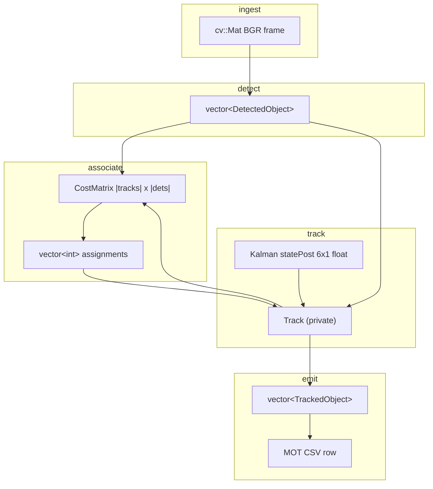

# Data flow

Types that cross stage boundaries, who allocates them, and the invariants the
next stage actually relies on. File paths are relative to the repo root.

## Boundary map



## `cv::Mat` frame

Produced by:

- `VideoSource::next(cv::Mat& frame)` → `capture_.read(frame)` (`src/video_source.cpp`)
- `cv::imread` of `{frame:06d}.jpg` in `apps/evaluate_mot.cpp`

Consumed by `YoloDetector::detect` / `MotionDetector::detect`. Empty-frame policy
diverges: YOLO throws `std::invalid_argument`; MOG2 will still `apply()` (OpenCV
behavior). `evaluate_mot` throws if `imread` returns empty.

No colorspace conversion in the apps. YOLO `blobFromImage(..., swapRB=true)`
treats the Mat as BGR. MOG2 consumes the Mat as-is.

## `DetectedObject` — detector → tracker

```cpp
// include/detection.hpp
struct DetectedObject {
    cv::Rect bounding_box;          // int, OpenCV 0-based xywh
    float area_confidence = 0.0;    // name is historical
};
```

| Producer | `bounding_box` | `area_confidence` |
|---|---|---|
| `YoloDetector::detect` | NMS-kept integer box, clamped to frame | max class score (or `class_id` score) |
| `MotionDetector::detect` | `cv::boundingRect(contour)` | `contourArea / (rows * cols)` |

Tracker (`MultiObjectTracker::update`) uses **only** `bounding_box`, cast to
`cv::Rect2f`. Confidence never enters the cost, the gate, or track birth.

`ClassifiedObject` (`classification`, `classification_confidence`) is unused.

Invariants the tracker does **not** enforce on input:

- boxes may be empty (IoU then 0)
- duplicate/overlapping detections are the detector's problem (YOLO NMS; MOG2 none)
- no class field — class filtering happens inside `YoloDetector` before this type exists

## Kalman state — owned by `Track::filter`

`BoundingBoxKalmanFilter` (`include/kalman.hpp`) wraps `cv::KalmanFilter`.

| Symbol | Value | Meaning |
|---|---|---|
| `kStateDimensions` | 6 | `[cx, cy, w, h, vx, vy]^T` |
| `kMeasurementDimensions` | 4 | `[cx, cy, w, h]^T` |
| `kControlDimensions` | 0 | no control input |
| `kMatrixType` | `CV_32F` | |

Transition (dt = 1 frame):

```text
F = I_6
F[0,4] = 1    cx' = cx + vx
F[1,5] = 1    cy' = cy + vy
```

`w` and `h` have no velocity. Measurement matrix H is 4×6 identity on the first
four states.

Noise (all diagonal, `cv::setIdentity`):

- `processNoiseCov` = `1e-2`
- `measurementNoiseCov` = `1e-1`
- `errorCovPost` init = `1.0`

Birth (`BoundingBoxKalmanFilter(const cv::Rect2f& initial_box)`):

```text
statePost = [x + w/2, y + h/2, w, h, 0, 0]^T
```

Public API:

```cpp
cv::Rect2f predict();                       // filter_.predict() → to_box
cv::Rect2f update(const cv::Rect2f& box);   // correct(measurement) → to_box
```

`to_box`: `w,h = max(0, state[2,3])`, origin = center − size/2. Negative sizes
from an unconstrained linear filter are clamped; they do not wrap.

Internal `Track::predicted_box` is overloaded:

- after `predict()`: prior box used for IoU
- after successful `update()`: posterior box copied to `TrackedObject`
- on miss: left as the prior (coasted)

The 6D `statePost` never leaves this class. Apps never see velocity.

## Cost matrix — tracker → Hungarian

```cpp
// include/hungarian.hpp
using CostMatrix = std::vector<std::vector<double>>;
static std::vector<int> solve(const CostMatrix& costs);
```

Built only when both tracks and detections are non-empty:

```text
costs[track_i][det_j] = 1.0 - IoU(predicted_box_i, Rect2f(det_j.box))
∈ [0, 1] for valid boxes
```

Contract (`HungarianAlgorithm::solve` in `src/hungarian.cpp`):

- rectangular; ragged → `std::invalid_argument`
- every entry finite; NaN/Inf → `std::invalid_argument`
- empty matrix → `{}`
- zero columns → `vector(row_count, -1)`
- if rows > cols, transpose, solve, un-transpose; leftover rows stay `-1`
- if rows ≤ cols, `solve_wide` (JV / successive shortest path with potentials);
  leftover columns stay unmatched

Return: `assignments.size() == costs.size()`. `assignments[i]` is a column index
or `-1`. Matching is min-sum, globally optimal (see
`tests/hungarian_test.cpp`: greedy-fail case `{1,2; 2,100}` → `{1,0}`).

Hungarian does not know about IoU. A pair with cost `0.95` (IoU 0.05) can be
assigned and then rejected by `kMinimumIou`.

## Assignment + gate → track mutation

Per track row:

```text
has_assignment = 0 <= assignments[i] < detections.size()
if has_assignment and IoU >= 0.30:
    filter.update(det_box); missed_frames = 0; mark det matched
else:
    missed_frames++
```

Gated-off detections remain in `matched_detections == false` and birth new tracks.
That is how `RejectsAssignmentsBelowMinimumIou` gets two tracks.

Deletion: `missed_frames > 5`. After five consecutive misses the track is still
emitted (`missed_frames == 5`). Sixth miss erases it before emit.

Birth: unmatched detection → `tracks_.emplace_back(next_id_++, box)`.
`next_id_` starts at 1, increments only on birth, never reset. ID 0 is unused.

## `TrackedObject` — tracker → apps

```cpp
// include/multi_object_tracker.hpp
struct TrackedObject {
    int id;
    cv::Rect2f bounding_box;
    int missed_frames;
};
```

`update()` returns `const std::vector<TrackedObject>&` into
`MultiObjectTracker::tracked_objects_`. Invalidated by the next `update()`.

| Field | Source | Notes |
|---|---|---|
| `id` | `Track::id` | stable until deletion |
| `bounding_box` | `Track::predicted_box` | posterior on hit, prior on miss, raw detection on birth frame |
| `missed_frames` | `Track::missed_frames` | 0 on hit/birth; live viz ignores this |

`apps/main.cpp` truncates `cv::Rect2f` → `cv::Rect` for drawing.

## MOT CSV — `evaluate_mot` → Python

```cpp
// apps/evaluate_mot.cpp
void write_box(ofstream& out, int frame, int id, const cv::Rect2f& box, float confidence);
// frame,id,x+1,y+1,w,h,conf,-1,-1,-1
```

Two files, same schema:

| File | `id` | `conf` | When |
|---|---|---|---|
| detections.csv | `-1` | `DetectedObject::area_confidence` | every YOLO box after NMS |
| tracks.csv | `TrackedObject::id` | `1.0F` | every live track including coasted |

`x+1, y+1`: MOTChallenge is 1-indexed pixels; OpenCV is 0-indexed. Width/height
unchanged. Trailing `-1,-1,-1` are unused class/visibility placeholders.

Python `evaluation.evaluate.parse_mot`:

```text
Row(frame, identity, box=(x,y,w,h), confidence, class_id, visibility)
```

GT parse (`ground_truth=True`) reads columns 7–8 as class/visibility. Tracker/det
files leave those at `-1`. Scoring:

- GT kept if `confidence == 1.0` (marked)
- targets = MOT17 class 1 (pedestrian)
- ignored = classes `{2, 7, 8, 12}`
- predictions overlapping ignore regions at IoU 0.50 are dropped **unless** they
  already matched a pedestrian target (`suppress_ignored_predictions`)
- MOTA/IDF1 via `motmetrics` distance `1 - IoU` with NaN below 0.50

COCO class 0 (`kCocoPersonClassId` in C++) ≠ MOT17 class 1 (`PEDESTRIAN_CLASS`
in Python). They meet only through the image pixels.

## Ownership of crossing types

| Object | Allocated by | Lifetime |
|---|---|---|
| `cv::Mat frame` | app loop stack | one iteration |
| `vector<DetectedObject>` | detector `detect()`, returned by value | one iteration |
| `CostMatrix` / `assignments` | `update()` locals | one call |
| `Track` + `BoundingBoxKalmanFilter` | `tracks_` | until miss timeout |
| `tracked_objects_` | `MultiObjectTracker` member | until next `update()` |
| MOT files | `evaluate_mot` ofstreams | process |

`HungarianAlgorithm` is a stateless static class. `YoloDetector` owns `cv::dnn::Net`.
`MotionDetector` owns the MOG2 subtractor (adaptive background, survives across frames).
`VideoSource` owns `cv::VideoCapture` (public `capture_`).
