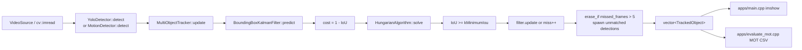

# MOT pipeline

End-to-end path as implemented. There is no detector/tracker abstract interface: apps
construct concrete types and call them in a frame loop. Tracking is SORT: constant-velocity
Kalman on box center/size, IoU cost, Hungarian assignment, IoU gate, miss-based deletion.

Python does **not** bind the C++ tracker. `evaluation/evaluate.py` downloads MOT17 frames,
builds `evaluate_mot`, runs it, and scores MOT CSV. `pyproject.toml` exists for Ultralytics
ONNX export and `motmetrics`.

## Targets

| Target | Sources | Role |
|---|---|---|
| `tracker_core` | `src/*.cpp` + `include/*.hpp` | All detection/association/track logic. No `main()`. |
| `tracker` | `apps/main.cpp` | Live capture + viz. |
| `evaluate_mot` | `apps/evaluate_mot.cpp` | Headless MOTChallenge CSV writer. |

`BoundingBoxKalmanFilter` is header-only (`include/kalman.hpp`). Eigen is linked
(`CMakeLists.txt`) but unused by the tracker; only `tests/sanity_test.cpp` includes it.

## Stage graph



## Constructors (once)

Live app (`apps/main.cpp`):

```text
argv parse → unique_ptr<YoloDetector> | unique_ptr<MotionDetector>
           → VideoSource(path | camera 0)
           → MultiObjectTracker tracker   // default ctor, no config args
```

- `YoloDetector(model_path, conf=0.25, nms=0.45, class_id=nullopt)` loads ONNX via
  `cv::dnn::readNetFromONNX`. Live `tracker` never passes `class_id`, so every COCO class
  competes via `max(class_scores)`.
- `MotionDetector` is an aggregate: default `cv::createBackgroundSubtractorMOG2()`,
  `min_area = 500.0`.
- `VideoSource(int)` / `VideoSource(const std::string&)` wrap `cv::VideoCapture`.
  `is_open()` is `capture_.isOpened()`.

Headless eval (`apps/evaluate_mot.cpp`):

```text
YoloDetector(model, 0.25, 0.45, class_id=0)  // COCO person only
MultiObjectTracker tracker
for frame in 1..N: cv::imread("{frame:06d}.jpg")
```

`evaluate_mot` has no `VideoSource`. Frame numbering is 1-based MOTChallenge, files
`000001.jpg` … under the image directory.

## Per-frame sequence

Canonical loop is `apps/main.cpp` lines 78–97:

```text
while (source.next(frame)):                          // VideoSource::next → VideoCapture::read
    detections = detector->detect(frame)             // YoloDetector or MotionDetector
    tracks     = tracker.update(detections)          // predict → associate → update → emit
    for track: rectangle + "ID {id}" on `frame`
    imshow("tracker", frame); waitKey(1); 'q' quits
```

`MultiObjectTracker::update` (`src/multi_object_tracker.cpp`) is the whole tracker step.
It is not split into public `predict()` / `associate()` APIs.

### 1. Predict

```cpp
for (Track& track : tracks_)
    track.predicted_box = track.filter.predict();
```

Each private `Track` owns a `BoundingBoxKalmanFilter`. `predict()` calls
`cv::KalmanFilter::predict()` and maps the 6D state back to `cv::Rect2f`. dt is implicitly
1 frame: `F[0,4] = F[1,5] = 1`. Unmatched tracks still predict, so coasted boxes are what
get emitted and associated next frame.

### 2. Cost matrix

Skipped if `tracks_.empty() || detections.empty()`. Otherwise:

```text
costs[t][d] = 1.0 - IoU(tracks_[t].predicted_box, Rect2f(detections[d].bounding_box))
shape: |tracks| × |detections|
```

`DetectedObject::bounding_box` is `cv::Rect` (int); promoted to `cv::Rect2f` at this
boundary. `area_confidence` is ignored by the tracker.

IoU (`MultiObjectTracker::intersection_over_union`): degenerate if any width/height ≤ 0
→ 0. Intersection is `first & second`. Union 0 → 0.

### 3. Associate

```cpp
assignments = HungarianAlgorithm::solve(costs);
// assignments[track_index] ∈ {detection_index, -1}
```

`-1` means that track row had no column (more tracks than detections). Hungarian itself
does **not** apply the IoU gate; it always returns a minimum-cost matching of `min(T, D)`
pairs. Low-IoU pairs are rejected in the next step.

### 4. Gate, correct, miss

For each track:

1. If assigned and `IoU(predicted_box, detection_box) >= kMinimumIou` (0.30):
   `predicted_box = filter.update(detection_box)`, `missed_frames = 0`, mark detection matched.
2. Else: `++missed_frames`. Assigned-but-gated detections stay unmatched and can spawn
   new tracks. The original track coasts on its prediction.

`filter.update` builds measurement `[cx, cy, w, h]` and calls `cv::KalmanFilter::correct`.
After a hit, `Track::predicted_box` is the **posterior** box, not the prior. That is what
is copied into `TrackedObject::bounding_box`.

### 5. Delete / spawn

```cpp
std::erase_if(tracks_, [](const Track& t) { return t.missed_frames > kMaximumMissedFrames; });
// kMaximumMissedFrames = 5  →  track survives 5 empty updates, dies on the 6th
for unmatched detection:
    tracks_.emplace_back(next_id_++, detection.bounding_box);
```

New `Track` ctor: `Track(id, box)` → `BoundingBoxKalmanFilter(box)`, `predicted_box = box`,
`missed_frames = 0`. IDs start at `next_id_ = 1` and never reuse. Spawned tracks are **not**
Kalman-updated on the birth frame; the public box is the detection box.

Invariant covered by `tests/multi_object_tracker_test.cpp`:
- empty in → empty out
- ID stable under detection reorder
- drop after 5 miss frames (6th empty `update` is empty)
- assignment with IoU below 0.30 does not steal the ID; both old (miss=1) and new track exist

### 6. Emit

```cpp
tracked_objects_.clear();
for (const Track& t : tracks_)
    tracked_objects_.push_back({t.id, t.predicted_box, t.missed_frames});
return tracked_objects_;  // const std::vector<TrackedObject>&
```

Returned reference aliases `tracked_objects_`. Next `update()` clears it. Coasting tracks
(`missed_frames > 0`) are included until deletion.

## Detection stages (mutually exclusive)

Apps pick one detector. Both return `std::vector<DetectedObject>`.

### YOLO — `YoloDetector::detect(const cv::Mat&)`

`src/yolo_detector.cpp`:

1. Reject empty frame.
2. `cv::dnn::blobFromImage(frame, blob, 1/255, Size(640,640), Scalar(), swapRB=true, crop=false)`.
   **No letterbox.** Non-square frames are stretched. Box decode scales by
   `frame.cols/640` and `frame.rows/640`.
3. `network_.setInput(blob); network_.forward()`.
4. `candidate_rows(output)` accepts `[1, features, candidates]` (Ultralytics) or
   `[1, candidates, features]`. Result: `CV_32F` rows × (4 box + C class scores).
5. Per row: confidence = `class_scores[class_id]` if filtered, else `max(class_scores)`.
   Drop if non-finite or `< confidence_threshold_`.
6. Decode `cx,cy,w,h` in 640-space → clamp to frame → integer `cv::Rect`.
7. `cv::dnn::NMSBoxes(boxes, confidences, conf, nms, kept_indices)`.
8. `DetectedObject{box, confidence}` — `area_confidence` is the class score, not area.

`evaluate_mot` sets `class_id = 0` (COCO person). Live `tracker --yolo` does not.

### MOG2 — `MotionDetector::detect(const cv::Mat&)`

`src/motion_detector.cpp`:

1. `subtractor->apply(frame, mask)` — 0 bg, 127 shadow, 255 fg.
2. `threshold(mask, 200, 255, THRESH_BINARY)` drops shadows.
3. Open then close with 5×5 ellipse.
4. `findContours(..., RETR_EXTERNAL, CHAIN_APPROX_SIMPLE)`.
5. Drop `contourArea < min_area` (500). Box = `boundingRect`.
   `area_confidence = area / (rows * cols)`.

MOG2 state lives in `MotionDetector::subtractor` across frames. YOLO is stateless
per call (weights loaded once).

## Outputs

### Viz (`apps/main.cpp`)

Green `cv::rectangle` + `putText "ID {id}"` on the BGR frame. `kFrameDelayMilliseconds = 1`.
No MOT file, no detection overlay, no miss-state styling. `TrackedObject::missed_frames`
is unused here.

### MOT CSV (`apps/evaluate_mot.cpp`)

`write_box(out, frame, id, box, confidence)`:

```text
frame,id,x+1,y+1,w,h,conf,-1,-1,-1
```

`+1` converts OpenCV 0-based origin to MOTChallenge 1-based pixels. Detections use
`id = -1` and `conf = DetectedObject::area_confidence`. Tracks use real IDs and
`conf = 1.0` (not detection score, not Kalman covariance). Empty frames still run
`tracker.update({})` so coasted tracks get written until deletion.

Python scoring (`evaluation/evaluate.py`) parses those files, suppresses predictions
overlapping MOT17 ignore classes `{2,7,8,12}` at IoU 0.50 (after protecting class-1
pedestrian matches), then `motmetrics.MOTAccumulator` for MOTA/IDF1/FP/FN/IDSW plus
detection precision/recall.

## Sequence (live `tracker`)

```mermaid
sequenceDiagram
    participant Main as apps/main.cpp
    participant Src as VideoSource
    participant Det as YoloDetector / MotionDetector
    participant Mot as MultiObjectTracker
    participant KF as BoundingBoxKalmanFilter
    participant Hun as HungarianAlgorithm

    Main->>Src: next(frame)
    Src-->>Main: cv::Mat
    Main->>Det: detect(frame)
    Det-->>Main: vector<DetectedObject>
    Main->>Mot: update(detections)
    loop each Track
        Mot->>KF: predict()
        KF-->>Mot: predicted_box
    end
    Mot->>Mot: costs[t][d] = 1 - IoU
    Mot->>Hun: solve(costs)
    Hun-->>Mot: assignments (det index or -1)
    loop each Track
        alt IoU >= 0.30
            Mot->>KF: update(detection_box)
            KF-->>Mot: posterior box
        else miss
            Mot->>Mot: missed_frames++
        end
    end
    Mot->>Mot: erase missed_frames > 5; spawn unmatched
    Mot-->>Main: vector<TrackedObject>&
    Main->>Main: rectangle + ID label; imshow
```

## What is not in the pipeline

- No ReID / appearance cost. Association is IoU only.
- No camera-motion compensation.
- No `ClassifiedObject` usage (`include/detection.hpp` only).
- No public predict/update split; no tracker config struct.
- No Python extension module.
- Kalman width/height have no velocity; only `cx, cy` couple to `vx, vy`.
